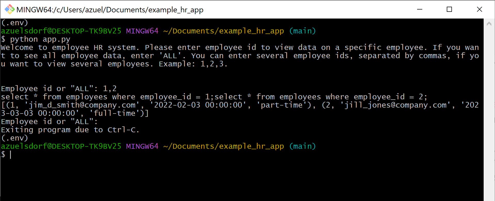
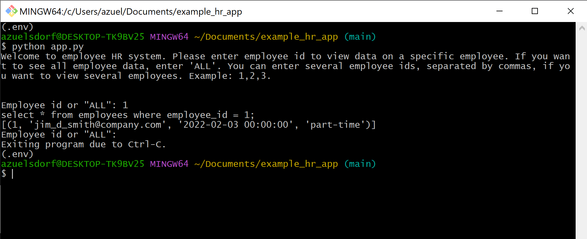
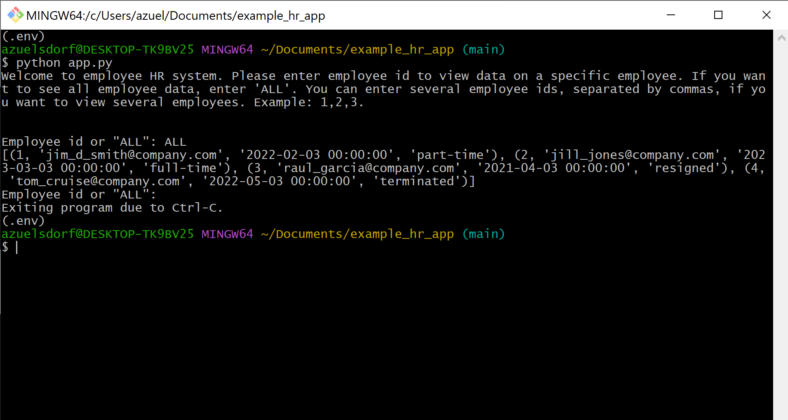

## Overview ##
This program allows one to see the information for a given employee, subset of employees, or all employees.

## Supported Commands ##
To view information for employees 1 and 2:

To view information for employee 1 only:

To view information for all employees:

